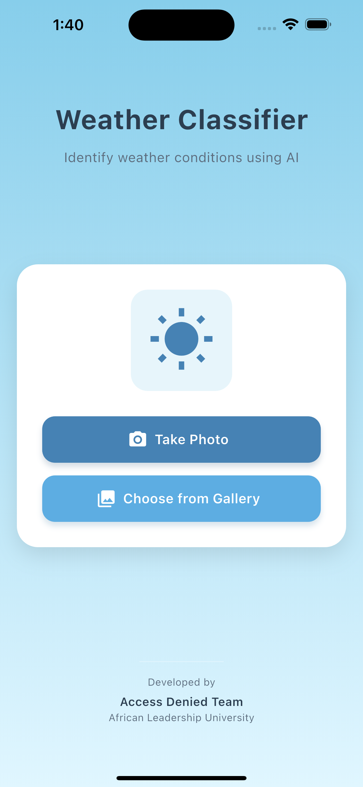
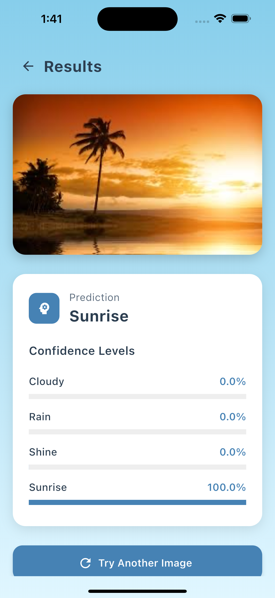

# Weather Classifier App

A Flutter application that uses machine learning to classify weather conditions from images. This project was developed for the IndabaX South Sudan 2025 AI Hackathon.

## Features

- **Weather Classification**: Identify weather conditions (Cloudy, Rain, Shine, Sunrise) from images
- **Camera Integration**: Take photos directly within the app
- **Gallery Selection**: Choose existing images from your device
- **Real-time Predictions**: Get instant classification results
- **Confidence Scores**: View confidence levels for each weather category
- **Modern UI**: Beautiful, intuitive interface with smooth animations

## Home


## Prediction


## Technologies Used

- **Flutter**: Cross-platform UI framework
- **TensorFlow Lite**: On-device machine learning
- **Camera API**: Device camera integration
- **Image Processing**: Image manipulation and preprocessing

## Model Information

The app uses a TensorFlow Lite model trained to classify weather conditions into four categories:
- Cloudy
- Rain
- Shine
- Sunrise

## Getting Started

### Prerequisites

- Flutter SDK (3.8.0 or higher)
- Android Studio / Xcode
- A physical device or emulator

### Installation

1. Clone the repository:
   ```bash
   git clone https://github.com/yourusername/weather_classifier.git
   ```

2. Navigate to the project directory:
   ```bash
   cd weather_classifier
   ```

3. Install dependencies:
   ```bash
   flutter pub get
   ```

4. Run the app:
   ```bash
   flutter run
   ```

## Building for Production

### Android

```bash
flutter build apk
```

The APK file will be located at `build/app/outputs/flutter-apk/app-release.apk`

### iOS

```bash
flutter build ios
```

Then use Xcode to archive and distribute the app.

## Project Structure

- `lib/`: Contains all Dart code
  - `main.dart`: Entry point of the application
  - `splash_screen.dart`: Initial loading screen
  - `home_page.dart`: Main screen with camera and gallery options
  - `camera_screen.dart`: Camera interface
  - `model_service.dart`: ML model integration
  - `results_page.dart`: Display classification results
- `assets/`: Contains images and model files
  - `models/`: Contains the TensorFlow Lite model
  - `weather_icon.png`: App icon and images

## About IndabaX South Sudan 2025 AI Hackathon

This project was developed as part of the IndabaX South Sudan 2025 AI Hackathon, which focuses on applying artificial intelligence solutions to local challenges. The Weather Classifier app demonstrates how machine learning can be used for environmental monitoring and weather prediction in regions where traditional meteorological infrastructure may be limited.

## Team

**Access Denied Team**   
- Chol Daniel 
- Kenisa Majhok
- Nhial Majok
- Ajang Chol
  
African Leadership University

## License

This project is licensed under the MIT License - see the LICENSE file for details.

## Acknowledgments

- TensorFlow team for the machine learning framework
- Flutter team for the UI framework
- IndabaX South Sudan for organizing the hackathon
